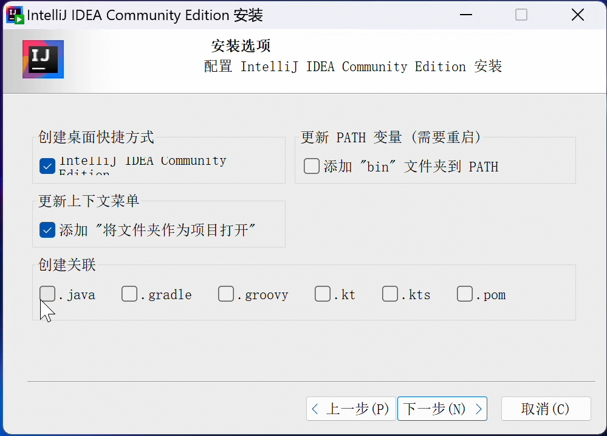

## IDEA Community 2023.1 Chinese Installer Edition Patch Files

IDEA Community 2023.1 Simplified Chinese Installer Patches Instruction, tested for 231.8109.175

https://www.jetbrains.com.cn/idea/download/other.html

Download sources for 2023.1 - Sources Archive (zip)

Then copy files under `patch` to the source code and specify file encoding:

These files are for NSIS installer:

GBK
build/conf/nsis/desktop.ini

UTF-8
build/conf/nsis/idea.nsi

UTF-8
build/conf/nsis/idea_cn.nsi

GBK
build/conf/nsis/UninstallOldVersions.ini

The below file is used to bundle a Chinese (Simplified) Language Pack(Optional):
UTF-8
build/src/org/jetbrains/intellij/build/IdeaCommunityProperties.kt

Create a new directory

build/bundle_plugins

Download the plugin Chinese (Simplified) Language Pack  and put it into the above folder: https://plugins.jetbrains.com/plugin/13710-chinese-simplified-language-pack----/versions/stable/313038

Then build installers as the IDEA CE source code's README.md said:
Build installers only for the current operating system: `./installers.cmd -Dintellij.build.target.os=win`

## A test installer made for the demo
Link: https://pan.baidu.com/s/1f65r32-i2C2OdQDDzLcwjw?pwd=uqfk

